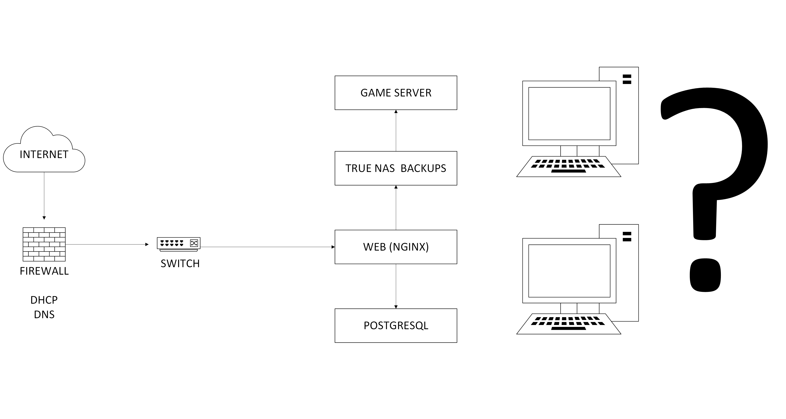
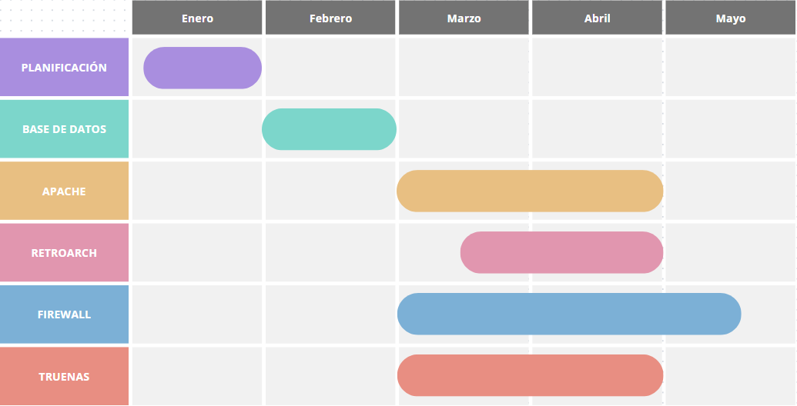

# ARQUITECTURA

# Especificar objetivos y las funcionalidades. 

Nuestra meta es la creación de una página web que implemente un emulador de WII (Dolphin), nuestro objetivo principal es hacer que el emulador pueda tener modo online 

 

# Especificar listado de tareas. 

- Crear web 

- Configurar RetroArch 

- Hacer arquitectura de la web: navegabilidad del sitio web, mockup 

- Integrar RetroArch y Dolphin a la web 

- Pruebas y correcciones del rendimiento 

 

# Asignar roles y responsabilidades del equipo. 

- Iván Martín: Sistemas 

- Víctor Polo: Web 

 

 

El diagrama de la red. 

  

  

 

 

# Las tecnologías a implementar. 

Apache (Para web) 

TRUENAS (Back ups) 

POSTGRESQL (Bases de datos) 

 

# El hardware que se va a utilizar. 

Aún no sabemos seguro todo el hardware que usaremos al final del proyecto, pero de momento podemos decir que será 

## 2 Ordenadores con Ubuntu desktop 

  ·4048MB de memoria RAM
  
  ·4 CPU
  
  ·150GB de almacenamiento
  
  ·ISO Ubuntu 22.04.2
  
  ·32MB de vídeo

# Los servicios a implementar. 

- DNS  

- FIREWALL 

- DHCP 

 

# Los sistemas operativos a utilizar. 

- Ubuntu Desktop 

- Ubuntu Server 

- Windows 10  

 

# Establecer un diagrama de Gantt con los objetivos y resultados a alcanzar. 
  

  
<div align="left"
