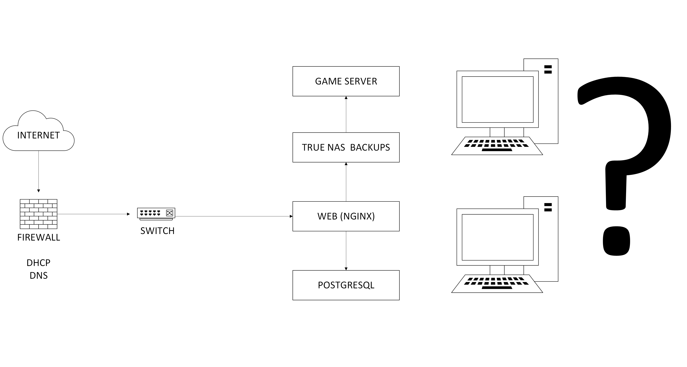
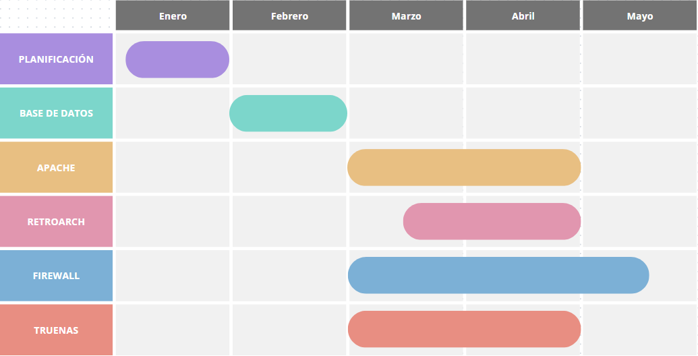
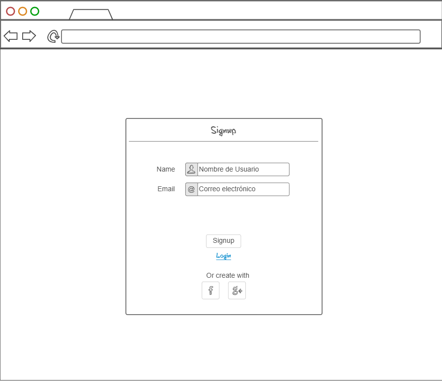

# MEDITACION GURÚ 
<!-- Improved compatibility of back to top link: See: https://github.com/othneildrew/Best-README-Template/pull/73 -->

<!--
*** Thanks for checking out the Best-README-Template. If you have a suggestion
*** that would make this better, please fork the repo and create a pull request
*** or simply open an issue with the tag "enhancement".
*** Don't forget to give the project a star!
*** Thanks again! Now go create something AMAZING! :D
-->

<!-- PROJECT SHIELDS -->
<!--
*** I'm using markdown "reference style" links for readability.
*** Reference links are enclosed in brackets [ ] instead of parentheses ( ).
*** See the bottom of this document for the declaration of the reference variables
*** for contributors-url, forks-url, etc. This is an optional, concise syntax you may use.
*** https://www.markdownguide.org/basic-syntax/#reference-style-links
-->

<!-- PROJECT LOGO -->
 

  

<!-- SOBRE NUESTRO PROJECTO -->

  

    
<h2>SOBRE NUESTRO PROYECTO 🧐🧐</h2>

En nuestro proyecto realizamos una página web en la cual nuestros clientes pueden publicar reseñas sobre películas, series y videojuegos. Para que así personas puedan echar un vistazo a las reseñas de la gente.

# Idea seleccionada 💡💡

-Página web con un sistema de emulación multijugador para juegos de GameCube y Wii. 

-Esta idea la hemos elegido porque a los dos nos apasiona el mundo de los videojuegos, y una parte importante de ellos son los videojuegos antiguos que no pudimos llegar a disfrutar, coneste proyecto lo que queremos hacer es revivir esos juegos y poderlos jugar con un multijugador para poder disfrutar de la experiencia original.

-Los juegos seleccionados para la página son nuestros juegos favoritos de la plataforma como; Super Smash Bros. Melee, Mario Kart: Double Dash!!, New Super Mario Bros. Wii, Donkey Kong Coutry Returns, entere otros.
 

# ¿Hasta donde queremos llegar con el proyecto? 🏁🏁

Nuestra intención es desarrollar una plataforma web dedicada que incorpore un emulador funcional, diseñado específicamente para permitir que dos equipos clientes se conecten de manera fluida y estable a un servidor central. De esta forma, los usuarios podrán interactuar entre si, disfrutando de una experiencia de juego compartida en línea, en tiempo real. Esta solución no solo fomentará la conectividad entre los jugadores, sinó que también garantizará un entorno de juego sincronizado y sin interrupciones, brindando una experiencia de alta calidad para ambos participantes.

 

# ¿A quién va dirigido nuestro proyecto? 📫📫

Nuestro público objetivo abarca desde adolescentes hasta adultos de diversas edades, ya que estamos convencidos de que nuestra propuesta tiene un atractivo universal que puede captar el interés de una amplia gama de personas. Creemos firmemente que nuestra idea tiene el potencial de resonar tanto en los jóvenes, quienes buscan nuevas experiencias de entretenimiento, como en los adultos que valoran la nostalgia, la interacción social y la calidad en las opciones de ocio. Este enfoque inclusivo nos permite dirigirnos a un espectro diverso de usuarios, maximizando el impacto de nuestra propuesta. 

 

# Módulos del ciclo que tengan que ver con el proyecto 📜📜

- Seguridad informática.

- Aplicaciones Web.

- Servicios de red.

- Sistemas operativos en red.

# Materiales necesarios ⛏️⛏️

 Físicos: Varios ordenadores 

 Lógicos: Máquinas virtuales, ISO  

 # Especificar objetivos y las funcionalidades. 

Nuestra meta es la creación de una página web que implemente un emulador de WII (Dolphin), nuestro objetivo principal es hacer que el emulador pueda tener modo online 

 

# Especificar listado de tareas. 

- Crear web 

- Configurar RetroArch 

- Hacer arquitectura de la web: navegabilidad del sitio web, mockup 

- Integrar RetroArch y Dolphin a la web 

- Pruebas y correcciones del rendimiento 

 

# Asignar roles y responsabilidades del equipo. 

- Iván Martín: Sistemas 

- Víctor Polo: Web 

 

 # Diagrama de la red.

Este es el diagrama de la red, donde podemos apreciar el esquema de como irá estructurada nuestra red y las direcciones IP que utilizaremos para esta. 

En el diagrama de la red podemos ver como se estructura nuestra red, también apreciamos las direcciones IP que usaremos.

  

  

 

 

# Las tecnologías a implementar. 

Apache (Para web) 

TRUENAS (Backups) 

POSTGRESQL (Bases de datos) 

 

# El hardware que se va a utilizar. 

Aún no sabemos seguro todo el hardware que usaremos al final del proyecto, pero de momento podemos decir que será 

| COMPONENTE        | SO                  | ALMACENAMIENTO | CPU          | RAM  | IP                | GATEWAY      |
|------------------|---------------------|----------------|--------------|------|-------------------|--------------|
| 🖥️ MAQUINA HOST  | Proxmox             | 465 GB         | 4            | 8 GB | 000.00.00.000     | 000.00.00.0  |
| 💻 CLIENTE       | Ubuntu 22.04.02     | 150 GB         | 4            | 4 GB | 000.000.0.00/00   | 000.000.0.0  |
| 🌐 DNS / DHCP    | Ubuntu 22.04.02     | 14 GB          | 1            | 2 GB | 000.000.0.0/00    | 000.000.0.0  |

# Los servicios a implementar. 

- DNS: Necesario para montar el servidor.

- DHCP:  

 

# Los sistemas operativos a utilizar. 

- Ubuntu Desktop 22.04.2

- Ubuntu Server 22.04.2

- Windows 10  22H2_Spanish

 

# Establecer un diagrama de Gantt con los objetivos y resultados a alcanzar. 

  

 # Incidencias 🚧🚧
 
A lo largo del trabajo han surgido varios problemas, aquí redactaremos todos estos a lo largo del proyecto:

- Configurando el DNS y el DHCP cometimos varios errores a la hora de la escritura de códigos y de comandos.
- Al final hemos cambiado la manera de hacerlo, usando el pi-hole con una interfaz gráfica en nuestro servidor.
- Hemos descargado el navegador y tenemos que descargar un navedador en el servidor.

  

    
<h2>FIREWALL 🐈🐈</h2>

Hemos configurado el PFSense y un cliente, el cual hemos conectado al PFSense y nos ha brindado una dirección IP dentro del dominio.

Configurar un firewall pfSense o Sophos según consideres: 

 

En la memoria tienes que escribir un resumen a partir de las preguntas teóricas de las actividades de M06 de pfSense. Esto es: 

 

## ¿Qué es pfSense y para qué se utiliza? 

 

-pfSense es usado como firewall y es de código abierto. Es utilizado principalmente para proteger nuestras redes de cualquier posible amenaza. 

 

## ¿En qué sistema se basa? 

 

-pfSense toma como base a FreeBSD, que es un sistema derivado de UNIX, el cual es muy estable y seguro 

 

## ¿Cuáles son las principales características de pfSense? 

 

Las características principales del pfSense son: 

Firewall con filtrado de paquetes 

VPN (OpenVPN e IPsec) 

Balanceo de carga y alta disponibilidad 

Servidor DHCP y DNS 

Captive Portal para control de acceso a redes 

IDS/IPS (detección y prevención de intrusos) 

Administración vía interfaz web 

 

 

## ¿Cómo se instala y configura pfSense? ¿Qué debemos tener en consideración al instalarlo en un entorno virtual? 

 

Lo primero que debemos hacer es instalar la ISO de la página principal de pfSense 

Requisitos mínimos de la máquina virtual para pfSense: 

· 1 CPU 

· 1 GB de memoria RAM 

· 10 GB de disco duro 

· 2 interfaces de red (ad.pnte y red interna) 

Después deberemos seguir toda la instalación del pfSense. 

Tendremos que configurar la red LAN para poder ver nuestra web, en nuestro caso la LAN es la 10.28.38.1 /24 y la WAN es la 100.77.20.56 /24 

Una vez establecida toda la configuración deberemos abrir nuestro PC cliente para podernos conectar, para ello, abriremos el navegador e introduciremos la dirección que nosotros hayamos establecido en la LAN 

 

## ¿Consideras pfSense una opción viable para empresas y redes domésticas? 

Nosotros consideramos que pfSense es una opción bastante buena y nos brinda bastante seguridad y encima su software es gratuito, así que cualquiera lo puede usar. Para empresas ofrece seguridad avanzada y VPN, y para el hogar permite controlar el tráfico, establecer reglas de firewall y mejorar la seguridad de la red. 

 

## ¿Qué es el port forward? Explica cómo lo has configurado. 

Es el reenvío de puertos, nos permite poder redirigir el tráfico de una IP a otra IP y nos ayuda a poder acceder a servidores internos desde el exterior, como si fuera un “puente”, a servidores como web o FTP. 

 

  

    
<h2>DNS/DHCP 😶‍🌫️😶‍🌫️</h2>

    
# Introducción al servicio (DNS y al DHCP)

## ¿Qué es?

  DNS (Domain Name System): Es un servicio que traduce nombres de dominio en direcciones IP. Facilita la navegación en internet y la gestión de redes.

  DHCP (Dynamic Host Configuration Protocol): Es un protocolo que asigna automáticamente direcciones IP y puertas de enlace y DNS a los dispositivos de una red.

## ¿Por qué es necesario?

DNS: Permite que los usuarios accedan a sitios web y recursos de red usando nombres en lugar de números difíciles de recordar.

DHCP: Simplifica la administración de redes al asignar IPs automáticamente, evitando conflictos de direcciones y configuraciones manuales.

## ¿Dónde hay información oficial?

- Al usar Linux para clientes y server en todo el trabajo, Bind9 se podria adaptar perfectamente a nuestras necesidades

  DNS: https://bind9.readthedocs.io/en/v9.20.7/ 

  DHCP: https://documentation.ubuntu.com/server/how-to/networking/install-isc-dhcp-server/index.html

## Extras

  DNS:

  DHCP:

## Instalación (DNS y del DHCP)

  DNS:

  DHCP:

## Detalles de la MV

  Servidor: 
  
· 2 CPU 

· 2 GB de memoria RAM 

· 25 GB de disco duro 

· 2 interfaces de red (ad.pnte y red interna) 

## Pasos a seguir

  DNS:

  DHCP:

## Incidencias

  DNS:

  DHCP:

  

  

    
<h2>TRUENAS </h2>

  

  

    
<h2>Página Web 🤡🤡</h2>

## ¿Qué es?

Apache es un servidor web de código abierto ampliamente utilizado para alojar sitios web y aplicaciones.

## ¿Por qué usarlo?

Fiabilidad y seguridad

Modularidad y compatibilidad con distintos lenguajes

Uso en entornos locales e internet

## Documentación oficial

https://httpd.apache.org/docs/

# Instalación en Ubuntu Server

## Configuración de la MV

SO: Ubuntu Server 20.04

RAM: 2GB

Disco: 20GB

Red: Red NAT "NatNetworkSMX2"

# Pasos

## Actualizar paquetes:

sudo apt update && sudo apt upgrade -y

## Instalar Apache:

sudo apt install apache2 -y

## Habilitar y verificar el servicio:

sudo systemctl enable --now apache2
sudo systemctl status apache2

## Configurar firewall:

sudo ufw allow 'Apache'
sudo ufw enable

 
# INCIDENCIAS (APACHE)⚠️⚠️

Durante la realizacion de el apartado de apache tubimos multiples problemas, todos devido a que nos quisimos adelantar y intentamos instalar PHP y MySQL antes de que lo explicaran en clase, esto nos hizo confundirnos a la hora de la instalacion y acabar complicandola demasiado hasta que salieron muchos errores con los archivos, lo que decidimos hacer al final es pasar todo de un debian a un ubuntu server, al hacer esto la instalacion fue mucho mas facil para nosotros y pudimos completarla sin mayor dificultad

## Mapa de la web

## Nuestro mapa de la web:

  

## Preview del home de la web:

  <a href=https://github.com/S0gt/MEDITACION-DE-GURU/blob/main/IMAGENES/Mapa%20de%20la%20web.jpg>
  
  

## Preview del login de la página:

<a href=https://github.com/S0gt/MEDITACION-DE-GURU/blob/main/IMAGENES/login.png>

## Preview de las reseñas de la web:

<a href=https://github.com/S0gt/MEDITACION-DE-GURU/blob/main/IMAGENES/login.png>

 

  

    
<h2>Recursos 🔎🔎</h2>

    

Los recursos a los que hemos recurrido en la creación del proyecto son:

- DNS: Consultar a los profes fallos ocurridos, y que nos aconsejaran que seria lo mejor, y utilizar el ChatGPT para no cometer errores a la hora de ls escritura de los comandos.
- Servidor: Una parte del firewall ya la tenemos creada gracias al pfsense 
- Clientes:
- Creación de la web:
- Implemetar emulador Dolphin en la web:

   

