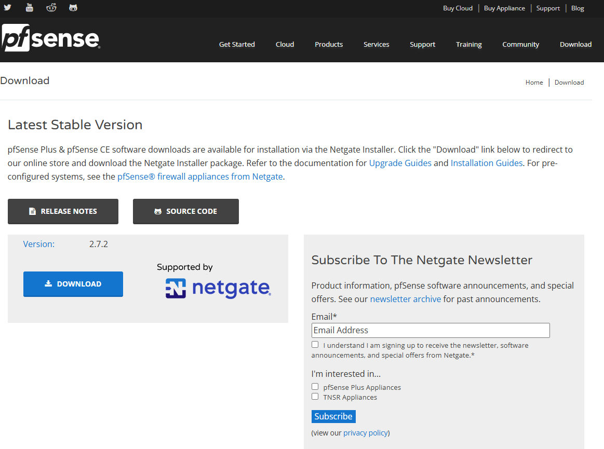

# MEDITACION GURÚ 
<!-- Improved compatibility of back to top link: See: https://github.com/othneildrew/Best-README-Template/pull/73 -->

<!--
*** Thanks for checking out the Best-README-Template. If you have a suggestion
*** that would make this better, please fork the repo and create a pull request
*** or simply open an issue with the tag "enhancement".
*** Don't forget to give the project a star!
*** Thanks again! Now go create something AMAZING! :D
-->

<!-- PROJECT SHIELDS -->
<!--
*** I'm using markdown "reference style" links for readability.
*** Reference links are enclosed in brackets [ ] instead of parentheses ( ).
*** See the bottom of this document for the declaration of the reference variables
*** for contributors-url, forks-url, etc. This is an optional, concise syntax you may use.
*** https://www.markdownguide.org/basic-syntax/#reference-style-links
-->

<!-- PROJECT LOGO -->
 

  

<!-- SOBRE NUESTRO PROJECTO -->

  

    
<h2>SOBRE NUESTRO PROYECTO 🧐🧐</h2>

En nuestro proyecto realizamos una página web en la cual nuestros clientes pueden publicar reseñas sobre películas, series y videojuegos. Para que así personas puedan echar un vistazo a las reseñas de la gente.

# Idea seleccionada 💡💡

Página web de reseña de películas, series y videojuegos, con la capacidad de crear listas personalizadas 

# ¿Hasta donde queremos llegar con el proyecto? 🏁🏁

Nuestra intención es tener una página en la que puedas hacer reseñas rápidas y sencillas, queremos que también puedas hacerte listas con tus contenidos favoritos que tienes pendientes por ver o jugar.
 
# ¿A quién va dirigido nuestro proyecto? 📫📫

Queremos centrarnos en un publico joven aunque no nos desagrada la idea de que sea para un publico general, nos queremos centrar en que sea agradable para que todos los publicos esten comodos al usar la pagina, queremos algo intuitivo y sencillo
 

# Módulos del ciclo que tengan que ver con el proyecto 📜📜

- Seguridad informática.

- Aplicaciones Web.

- Servicios de red.

- Sistemas operativos en red.

# Materiales necesarios ⛏️⛏️

 Físicos: Varios ordenadores 

 Lógicos: Máquinas virtuales, ISO  

 # Especificar objetivos y las funcionalidades. 

Nuestra meta es una web donde se puedan hacer reseñas de peliculas, series y videojuegos, tambien queremos que los usuarios puedan hacer listas de las peliculas, series y juegos para llear un orden o organizacion
 

# Especificar listado de tareas.

-Crear los servidores y configurarlos para que den los servicios que necesitamos
-Crear paginas web con frontend y backend
-Base de datos para que funcionen los registros

 

# Asignar roles y responsabilidades del equipo. 

- Iván Martín: Sistemas 

- Víctor Polo: Web 

 

 # Diagrama de la red.

Este es el diagrama de la red, donde podemos apreciar el esquema de como irá estructurada nuestra red y las direcciones IP que utilizaremos para esta. 

En el diagrama de la red podemos ver como se estructura nuestra red, también apreciamos las direcciones IP que usaremos.

  

  

 

 

# Las tecnologías a implementar. 

Apache, PHP y MySql (Para web) 

TRUENAS (Backups) 

PFsense (Firewall y DNS)

DHCP (backup)

# El hardware que se va a utilizar. 

Aún no sabemos seguro todo el hardware que usaremos al final del proyecto, pero de momento podemos decir que será 

| COMPONENTE        | SO                  | ALMACENAMIENTO | CPU          | RAM  | IP                | GATEWAY      |
|------------------|---------------------|----------------|---------------|------|-------------------|--------------|
| 🖥️ MAQUINA HOST  | Pfsense             | 50 GB          | 2             | 4 GB | 000.00.00.000     | 000.00.00.0  |
| 💻 CLIENTE       | Ubuntu 22.04.02     | 50 GB          | 4             | 4 GB | 000.000.0.00/00   | 000.000.0.0  |
| 🌐 DNS / DHCP    | Ubuntu 22.04.02     | 50 GB          | 2             | 4 GB | 000.000.0.0/00    | 000.000.0.0  |

# Los servicios a implementar. 

- DNS: Para que nuestro servidor sea capaz de resolver direcciónes web 

- DHCP: Para asignar las ip automáticamente a el resto de las máquinas virtuales 

# Los sistemas operativos a utilizar. 

- Ubuntu Desktop 22.04.2

- Ubuntu Server 22.04.2

- Windows 10  22H2_Spanish

 

# Establecer un diagrama de Gantt con los objetivos y resultados a alcanzar. 

  

 # Incidencias 🚧🚧
 
A lo largo del trabajo han surgido varios problemas, aquí redactaremos todos estos a lo largo del proyecto:

- Configurando el DNS y el DHCP cometimos varios errores a la hora de la escritura de códigos y de comandos.
- Al final hemos cambiado la manera de hacerlo, usando el pi-hole con una interfaz gráfica en nuestro servidor.
- Hemos descargado el navegador y tenemos que descargar un navedador en el servidor.

  

    
<h2>FIREWALL 🐈🐈</h2>

# INTRODUCCION A FIREWALL
## ¿Qué es pfSense y para qué se utiliza? 

-PfSense es un firewall de codigo abierto, se utiliza como firewall y enrutador, se usa por su interfaz sencilla y simple

## ¿En qué sistema se basa? 

-PfSense se basa en el sistema FreeBSD, es un sistema operativo multiusuario capaz de tener multitarea

## ¿Cuáles son las principales características de pfSense? 

Sus caracteristicas principales son su soporte para VPN, Balanceo de carga y su gestion de DNS y DHCP, tiene  muchas mas caracteristicas pero estas son las mas destacadas para nosotros 

## ¿Cómo se instala y configura pfSense? ¿Qué debemos tener en consideración al instalarlo en un entorno virtual? 

Para instalarlo es tan facil como ir a su web https://www.pfsense.org/download/ y desde ahi descargamos con facilidad la ISO

Luego en VirtualBox solo tenemos que crear una nueva maquina con recursos normales considerando que no tiene interfaz grafica 
seleccionamos FreeBSD como sistema y seguimos la instalacion que es bastante facil y intuitiva.

## ¿Consideras pfSense una opción viable para empresas y redes domésticas? 

Pese a que PfSense es muy util en nuestro caso a la hora de empresas hay opciones mas profesionales como podria ser Sophos, que es mas pesada pero tambien tiene muchas mas funciones, en el caso de redes domesticas consideramos que se podria usar PfSense sin ningun problema
 
## ¿Qué es el port forward? Explica cómo lo has configurado. 

Es un metodo de redireccion de puertos, se usa para que varios dispositivos se puedan interconectar, sobretodo se usa en cosas como camaras de seguridad o para poder conectarnos a servidores de juegos

Lo configuramos creando una nueva regla en la seccion NAT, configuramos la interfaz en WAN par trafico externo, protocolos usamos TCP/UDP, ponemos puerto de HTTP a HTTP, redirigimops a la ip que usamos en nuestro caso 10.28.38.100 y ya estaria 

# PRACTICA
Hemos configurado el PFSense y un cliente, el cual hemos conectado al PFSense y nos ha brindado una dirección IP dentro del dominio.

 

  

    
<h2>DNS/DHCP 😶‍🌫️😶‍🌫️</h2>

    
# Introducción al servicio (DNS y al DHCP)

## ¿Qué es?

  DNS (Domain Name System): Es un servicio que traduce nombres de dominio en direcciones IP. Facilita la navegación en internet y la gestión de redes.

  DHCP (Dynamic Host Configuration Protocol): Es un protocolo que asigna automáticamente direcciones IP y puertas de enlace y DNS a los dispositivos de una red.

## ¿Por qué es necesario?

DNS: Permite que los usuarios accedan a sitios web y recursos de red usando nombres en lugar de números difíciles de recordar.

DHCP: Simplifica la administración de redes al asignar IPs automáticamente, evitando conflictos de direcciones y configuraciones manuales.

## ¿Dónde hay información oficial?

- Al usar Linux para clientes y server en todo el trabajo, Bind9 se podria adaptar perfectamente a nuestras necesidades

  DNS: https://bind9.readthedocs.io/en/v9.20.7/ 

  DHCP: https://documentation.ubuntu.com/server/how-to/networking/install-isc-dhcp-server/index.html

## Extras

  DNS:

  DHCP:

## Instalación (DNS y del DHCP)

  DNS:

  DHCP:

## Detalles de la MV

  Servidor: 
  
· 2 CPU 

· 2 GB de memoria RAM 

· 25 GB de disco duro 

· 2 interfaces de red (ad.pnte y red interna) 

## Pasos a seguir

  DNS:

  DHCP:

## Incidencias

  DNS:

  DHCP:

  

  

    
<h2>TRUENAS ⛈️⛈️</h2>

  ## ¿Qué es?

  ## ¿Por qué usarlo?

  

  

    
<h2>Página Web 🤡🤡</h2>

## ¿Qué es?

Apache es un servidor web de código abierto ampliamente utilizado para alojar sitios web y aplicaciones.

## ¿Por qué usarlo?

Fiabilidad y seguridad

Modularidad y compatibilidad con distintos lenguajes

Uso en entornos locales e internet

## Documentación oficial

https://httpd.apache.org/docs/

# Instalación en Ubuntu Server

## Configuración de la MV

SO: Ubuntu Server 20.04

RAM: 2GB

Disco: 20GB

Red: Red NAT "NatNetworkSMX2"

# Pasos

## Actualizar paquetes:

sudo apt update && sudo apt upgrade -y

## Instalar Apache:

sudo apt install apache2 -y

## Habilitar y verificar el servicio:

sudo systemctl enable --now apache2
sudo systemctl status apache2

## Configurar firewall:

sudo ufw allow 'Apache'
sudo ufw enable

 
# INCIDENCIAS (APACHE)⚠️⚠️

Durante la realizacion de el apartado de apache tubimos multiples problemas, todos devido a que nos quisimos adelantar y intentamos instalar PHP y MySQL antes de que lo explicaran en clase, esto nos hizo confundirnos a la hora de la instalacion y acabar complicandola demasiado hasta que salieron muchos errores con los archivos, lo que decidimos hacer al final es pasar todo de un debian a un ubuntu server, al hacer esto la instalacion fue mucho mas facil para nosotros y pudimos completarla sin mayor dificultad

## Nuestro mapa de la web:

  

## Preview del home de la web:

  <a href=https://github.com/S0gt/MEDITACION-DE-GURU/blob/main/IMAGENES/Mapa%20de%20la%20web.jpg>
  
  

## Preview del login de la página:

<a href=https://github.com/S0gt/MEDITACION-DE-GURU/blob/main/IMAGENES/login.png>

## Preview de las reseñas de la web:

<a href=https://github.com/S0gt/MEDITACION-DE-GURU/blob/main/IMAGENES/login.png>

 

  

    
<h2>Recursos 🔎🔎</h2>

    

Los recursos a los que hemos recurrido en la creación del proyecto son:

- DNS Y DHCP de la guia de punkymo de Alina
- Para Apache hemos usado la una guia de Digital Ocean sobre Apache, PHP y MySQL: https://www.digitalocean.com/community/tutorials/how-to-install-lamp-stack-on-ubuntu
- FIREWALL: Para firewall usamos pfsense y nos guiamos por la guia de punkymo
- Copias de seguridad: Usamos True Nas y nos guiamos con la guia de punkymo nuevamente 

   

